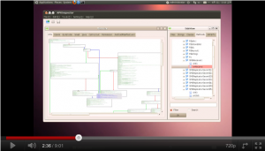

As the deadline of GSOC has passed, I would like to announce the APKinspector Beta1.0. APKinspector is a tool to help Android application analysts and reverse engineers to analyze the compiled Android packages and their corresponding codes. You can review the [Alpha version report](https://www.honeynet.org/node/747) and [the page of this project](http://code.google.com/p/apkinspector) to know more about it.

**Click the picture below to watch a full demonstration video of APKInspector:**

**Chinese viewers may view the demo at:** [http://v.youku.com/v\_show/id\_XMjk3ODAwMzU2.html](http://v.youku.com/v_show/id_XMjk3ODAwMzU2.html)

**Based on the Alpha release, APKinspector has added some features as follows:**

1. Show the Smali\[1\] codes by apktool.
2. Show each permission and where a permission is used in an application.
3. Show the AndroidManifest.xml of an application.
4. Specify a method and then show its call in/out methods. (Users can select any method in the method tab to look its call in/out methods. Moreover, users can click the “Tools” in the menu and select the “Call in/out” item. Then there’s a dialog popping up and waiting for users to fill the inquired method’s class name, name and its descriptor. Users can choose to view call in or call out, even both of them.)
5. Add interaction between the CFG and Dalvik. (From CFG tab to Dalvik tab, users can select a node of CFG and press the space bar. Then the view will be located in the corresponding codes. From Dalvik tab to CFG tab, users can place the cursor on any line and click with the right button of the mouse to select the “Goto CFG” item. And then the view will be located in the corresponding node of the CFG.) Show a hint when users move the cursor over the node of CFG.
6. Add syntax highlighting for Dalvik codes.
7. Add a find module to search words or sentences in each text tab.
8. Add a module of annotation. Users can add some annotations or notes for any line of codes. (Users could click the right button of the mouse and select the “Add Annotation” item. Then an annotation dialog will pop up at the bottom of the main view. )
9. Add a module of renaming. Users can rename any variables or others of codes. (Users could select what they want to rename and then click the right button of the mouse to select the “Renaming”. A renaming dialog will pop up for users filling the new name.)
10. Add a search and filter module to search /filter strings, classes and methods.
11. Add a configuration module to choose whatever modules you’d like to use.
12. Show a progress bar when opening and loading an apk.

Note that I use the dex2jar and JAD to get the java codes and the apktool to get the smali codes and AndroidMainifest.xml. CFG and formatted Dalvik codes are generated by the Androguard. These tools take a little time, which is about dozens of seconds. So users should wait a moment when opening for the pre-process of these tools.

You may download APKinspector by the link ( [http://code.google.com/p/apkinspector](http://code.google.com/p/apkinspector) ). Its documentation is also in this link.

If you test this tool and find some bugs, please send me an email, which is zc1988104(at)gmail(dot)com. I’m looking forward to your feedback.

\[1\] I made a mistake about the codes generated by Androguard, which are formatted Dalvik bytecodes and are not Smali codes. So, in the latest version, Dalvik bytecodes are what I call smali codes before.
