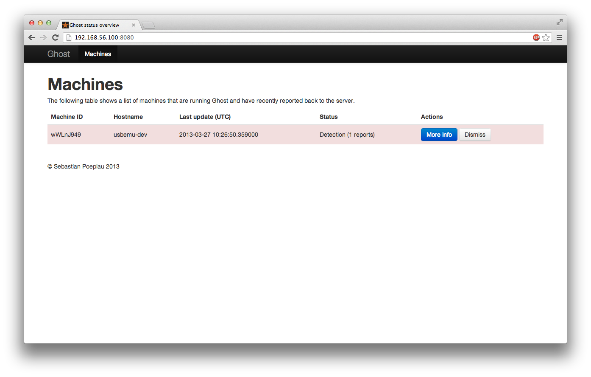

Today I've released version 0.3 of the Ghost USB honeypot, which introduces a lot of new features, including a completely rewritten core for better malware detection. The new version is available on the [project page](https://code.google.com/p/ghost-usb-honeypot/). This post outlines the major changes.

In a [previous blogpost](https://honeynet.org/node/1005) I've already written about the wide-ranging changes to the core of Ghost. We basically switched to a new emulation technique in order to make it harder for malware to recognize Ghost's fake USB device. The new core is considered stable by now and thus included in version 0.3.

One of the major goals for this release was to add a means for larger businesses to run Ghost on many machines. Until now, Ghost was limited to machine that it ran on - which means in particular that you'd have to check for alerts on each and every computer running Ghost. The new version addresses this issue as follows: 1. You can configure your instances of Ghost to submit all reports to a single server in your organization, which then collects the data from all machines in a database for later analysis. 2. A web frontend displays the status of all computers that are connected to the database and allows you to review reports in case of an infection. With those two components in place, you are now able to observe the state of all your machines running Ghost - in a single place! The snapshot below shows the web frontend.

As an optional component, I have included a filter driver that can block write access to flash drives. The idea is that whenever a machine gets infected with USB malware, you don't want it to pollute your flash drives. So you can instruct Ghost to make all USB storage read-only after it has detected an infection. This way, you don't have to fear about malware infecting other machines via flash drives.

In a future blogpost I'm going to explain how to set up the new management features, so stay tuned!
