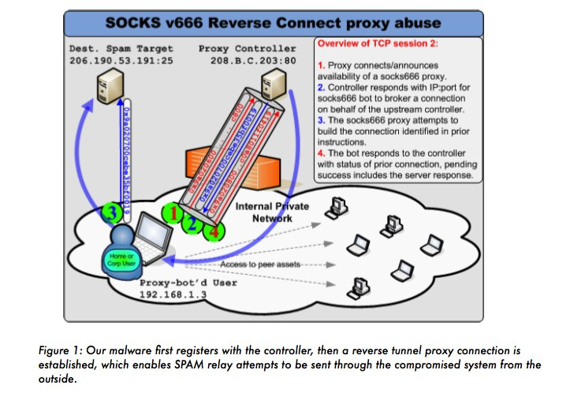
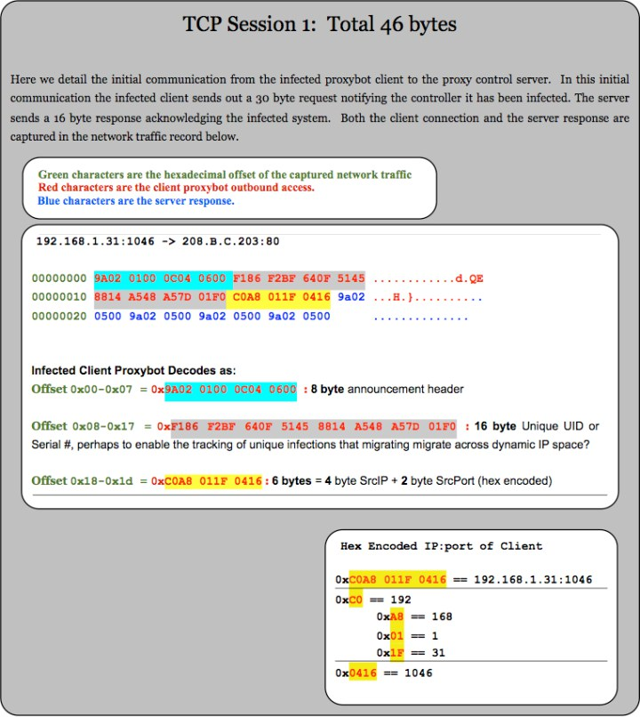
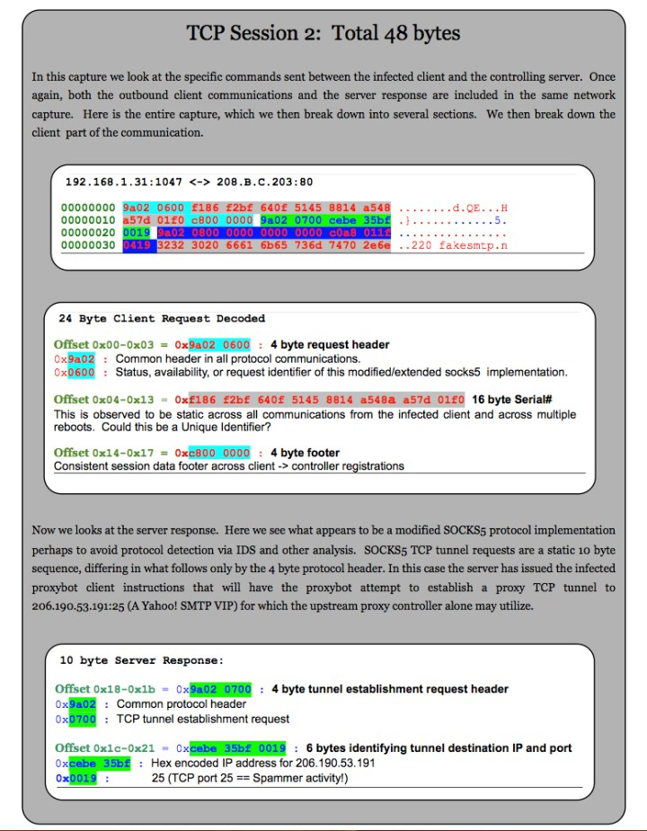
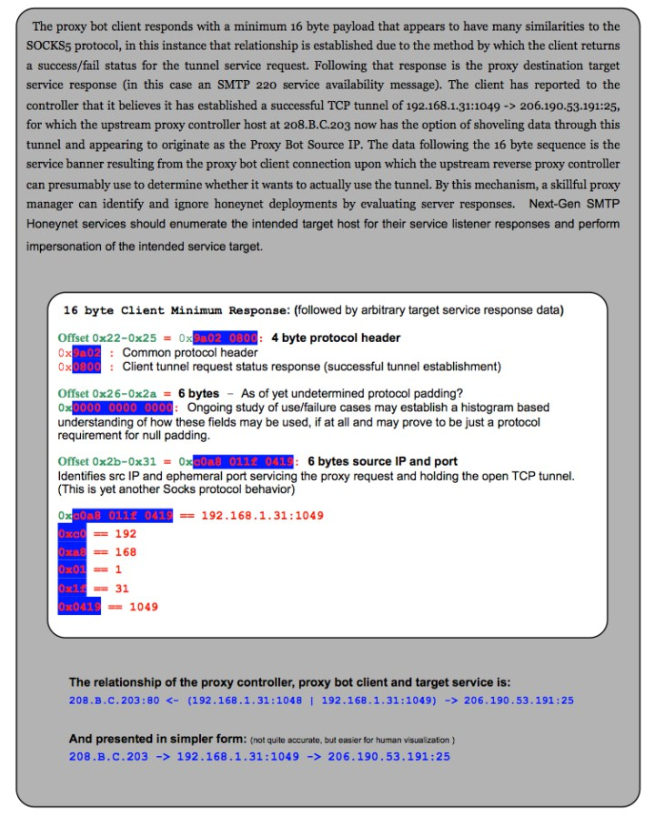

## Introduction

A common assumption within the network and security community is that Network Address Translation (NAT) and filtering devices such as routers and firewalls provide protection from direct inbound attack and control. Networked systems behind devices of this type are usually assigned private (non-routable) IP addresses and may be screened from arbitrary inbound connections which prevent attackers from initiating connections to these presumed 'protected' network assets. To bypass this perimeter defense, attackers have depended on malware to infect the host systems and initiate an outbound connection to a command and control system, perhaps becoming part of a botnet to wait for and then execute commands. The Honeynet Project is studying a different technique that is becoming increasingly widespread in the criminal community. Criminals are leveraging systems behind these security devices as reverse tunnel proxies and are able to perpetrate criminal activities that include sending spam email, attacking web applications, or even targeting internal private network assets.

In this paper we will detail: the basic operational concept of how these reverse tunnel proxies work, one such control protocol in use, the advantages to the criminal community, a detailed example and its similarities to legacy SOCKS protocols, and how this activity can be further identified including mitigation strategies.

## Socks Background

First of all a proxy is an application or system which services the requests of clients by forwarding the requests to other servers. SOCKS is an internet protocol which allows for the transparent proxying of applications. The SOCKS protocol was developed at MIPS in the early 1990's and became public in 1992 when SGI purchased MIPS Computer Systems. RFC's for SOCKS v4 (NEC) and v5 followed.

SOCKS4 provided for connections to arbitrary TCP services and operates on layer 5 (SESSION) of the OSI model. This places it below the Presentation (ex. SSL) and Application (ex. HTTP) layers which is what makes it transparent to application protocols. Many alternative proxy methods at the time required application changes which becomes more difficult to support as new applications and protocols are developed. SOCKS4 supports TCP connections only and optionally simple authorization using a userid. SOCKS4a added support for sending proxy requests before resolving the domain name of the target. SOCKS5 (RFC1928) built on SOCKS4/4a and added support for UDP proxy connections, authentication methods, and Ipv6. In a standard SOCKS connection a client connects to a SOCKS proxy server and makes a CONNECT request which specifies the destination IP (or domain name) and port it would like the server to connect to on its behalf.

In typical proxybot infections we investigate proxy servers are installed on compromised machines on random high ports (above 1024) and the miscreants track their active proxies by making them "call home" and advertise their availability, IP address, and port(s) their proxies are listening on. These aggregated proxy lists are then used in-house, leased, or sold to other criminals. Proxies are used for a variety of purposes by a wide variety of people (some who don't realize they are using compromised machines), but spam (either SMTP-based or WEB-based) is definitely the top application. The proxy "user" will configure their application to point at lists of IP:Port combinations of proxybots which have called home. This results in a TCP connection from the "outside" to a proxybot on the "inside" and a subsequent TCP (or UDP) connection to the target destination (typically a mail server on the "outside"). How reverse-connect proxies differ will be highlighted in the next section.

## How and why socks v666 proxy networks work

Reverse-connect (or reverse tunnel) proxies are often a result of a compromise of a victim host residing behind NAT, firewall, or other filtering devices. Traditional proxy bots also typically involve compromises and may be deployed by the same exploits or methods (malware by email, etc.). However the key differentiator is the presence of a NAT or firewall device which would prevent the traditional inbound SOCKS requests described previously. What makes reverse-connect proxies unique is what happens afterwards. With traditional botnet malware, the infected system might initiate an outbound connection (using a protocol such as IRC, HTTP, or P2P) to a command and control system (C&C); wait for a command; then execute those commands on behalf of the controller. These outbound connections are allowed by default with many NAT and filtering devices. Reverse tunnel proxy botnets differ from classic IRC-based botnets in that they establish dedicated proxies, to which only their respective controller(s) may initiate tunnel service requests. This is accomplished after the victim host first establishes a persistent outbound TCP connection which enables the controller to establish new SOCKS connections from the outside as long as the persistent connection is maintained. These methods have been allowed to grow in popularity because many networks fail to enforce strong egress policies and many lack effective protocol inspection or enforcement capabilities. See figure 1 for a diagram demonstrating this capability.

So why are we calling these proxies ... and why the name Proxy v666? In the example below we demonstrate that these malware variants implement many similar functions found in the traditional SOCKS v5 proxy control protocol. The SOCKS v5 protocol uses a header (0x0501) to identify the protocol version when initiating a TCP connection . The reverse tunnel proxy protocol specifies its own custom header of (0x9a02) and the hex string (0x029a) equals "666" in ASCII. We can see that the criminal community maintains its own morbid sense of humor. The primary motivator for forming large networks of reverse-connect proxy bots is spam. We are seeing criminals actively using these reverse- connect proxies to relay millions of spam messages to victims around the world. There is a pre-existing underground economy revolving around proxies with numerous marketplaces, and tools which collect, validate, chain together, and abuse proxies of all types. There is a market incentive to provide SOCKS proxies compatible with existing tools. Additionally, the worldwide migration from dial-up networking to broadband connections utilizing NAT gateways (cable/DSL routers) has also been driving the need for criminals to come up with new ways to illegally leverage these resources. Additional advantages include:

1\. The benefit of hiding in plain sight through the implementation of a presumably undetectable or obscure control protocol with the specialized purpose of delivering ease of use in establishing arbitrary and anonymous connectivity to criminals. 2. External SSH, SSL, and other services implementing native encryption can be attacked via a reverse-connect proxy without triggering network IDS or other systems performing content inspection. 3. Corporate incident responders may incorrectly accuse owners of proxybot hosts as being the actual attacker and miss the external control mechanism and real perpetrator.

## Detailed Example

The following example of a reverse-connect proxy is from just one sample among many that we are seeing in the wild. Most of the data we have collected suggests they are based upon existing SOCKS protocol implementations. This bot sample was additionally designed to evade network port filtering. The proxy bot will iterate through a list of ports until a connection to the controller succeeds. For instance, if port 80 was unreachable it would then attempt to connect to the following ports (in-order): 8080, 3128, 21, 22, 53, 110, 5190, 143, 119, 137, 138, 443, 530, 873, 989, 990. One can see from the list of ports the miscreants have chosen that they are taking advantage of the common practice of allowing outbound connections to popular services by port and protocol without additional inspection. However many networks and most home consumer devices don't implement egress filtering at all and the first port (80/TCP) usually works fine.

Reverse Tunnel Proxy Malware Sample

Sample: 005e9054d4290c76db9e7971f6a10a4e File type(s): MS-DOS executable (EXE), OS/2 or MS Windows Size: 14848 Bytes MD5: 005e9054d4290c76db9e7971f6a10a4e SHA1: 13b22857d857ab6a8a315f086c8fcdac6064aaab

In the following malware sample, we examine just the first two TCP sessions of the many that were extracted using the Chaosreader packet capture session reassembly tool (http://chaosreader.sf.net/). The packet capture was acquired during the execution of the referenced sample in an instrumented malware analysis environment (sandbox). The sessions below depict the reverse tunnel proxy announcement/registration phase which is followed immediately by controller-initiated spam relay attempts. See Figure 1 for a visual example.

## TCP Session reassembly and decoding

## Detection

### Snort IDS

Several signatures are available in the Emerging Threats Snort IDS rulesets:

alert tcp $HOME\_NET any -> $EXTERNAL\_NET $HTTP\_PORTS (msg:?Emerging-EDGE CURRENT\_EVENTS Unknown Proxy Method/Bot Initial Packet?; flow:established,to\_server; dsize:24; content:?|9a 02 06 00|?; offset:0; depth:4; flowbits:set,BS.BPcheckin; flowbits:noalert; classtype:trojan-activity; reference:url,doc.emergingthreats.net/2006396; sid:2006395; rev:1;)

alert tcp $EXTERNAL\_NET $HTTP\_PORTS -> $HOME\_NET any (msg:?Emerging-EDGE CURRENT\_EVENTS Unknown Proxy Method/Bot Connect Command Packet?; flowbits:isset,BS.BPcheckin; flow:established,from\_server; dsize:10; content:?|9a 02 07 00|?; offset:0; depth:4; flowbits:set,BS.BPset; classtype:trojan-activity; reference:url,doc.emergingthreats.net/ 2006396; sid:2006396; rev:1;)

alert tcp $HOME\_NET any -> $EXTERNAL\_NET $HTTP\_PORTS (msg:?Emerging-EDGE CURRENT\_EVENTS Unknown Proxy Method/Bot Successful Connect Packet Packet?; flowbits:isset,BS.BPset; flow:established,to\_server; dsize:16; content:?|9a 02 08 00|?; offset:0; depth:4; flowbits:set,BS.BPcheckin; tag:session; classtype:trojan-activity; reference:url,doc.emergingthreats.net/ 2006396; sid:2006397; rev:1;)

alert tcp $HOME\_NET any -> $EXTERNAL\_NET $HTTP\_PORTS (msg:?Emerging-EDGE CURRENT\_EVENTS Unknown Proxy Method/Bot Checkin Packet?; flow:established,to\_server; dsize: 30; content:?|9a 02 01 00|?; offset:0; depth:4; flowbits:set,BS.BPcheckin1; flowbits:noalert; classtype:trojan-activity; reference:url,doc.emergingthreats.net/2006396; sid:2006398; rev:1;)

alert tcp $EXTERNAL\_NET $HTTP\_PORTS -> $HOME\_NET any (msg:?Emerging-EDGE CURRENT\_EVENTS Unknown Proxy Method/Bot Checkin Success Packet?; flowbits:isset,BS.BPcheckin1; flow:established,from\_server; dsize:4; content:?|9a 02 05 00|?; offset:0; depth:4; classtype:trojan-activity; reference:url,doc.emergingthreats.net/2006396; sid:2006399; rev: 1;)

Service providers should become suspicious when protocols such as SMTP or SSL are detected flowing inbound to user networks over non-standard ports. There are IDS signatures in the Emerging Threats rulesets for this purpose. Check out the ?unusual-client-port-connection? class of EmergingSnort rules for examples.

### **Network Flow**

A number of methods exist for collecting and aggregating IP accounting information from switches, routers, or probes. One popular solution which is implemented on many network devices is Netflow. Netflow was developed at Cisco in 1996 and allows for visibility into large network segments which would be impractical to monitor with packet capture methods. Netflow records contain several fields of interest to us in detecting reverse-connect proxy bots: Timestamps for the flow start and finish time, Number of bytes and packets observed in the flow, Source & destination IP addresses, Source and destination port numbers, IP protocol, Cumulative TCP flags.

1\. High resolution netflow may provide generic proxy and stepping stone detection methods. 2. Sampled netflow may also be used to detect policy violations and large or long duration flows. 3. Watchlists of known bad IPs such as proxy bot controllers can be used to look for suspicious flows. 4. Baselines of typical activity per system or per segment can be created based on metrics such as: bytes transferred per day, number of unique IP addresses contacted per day, and the number of packets per day per port/protocol. 5. Monitoring for deviations from these baselines can help identify systems whose personality changes abruptly such as one becoming a spam sender or proxy.

### **DNS**

1\. DNS query logs can be monitored for clients attempting to resolve known bad domains. 2. Statistics can also be maintained to create baselines of DNS resolution activity and to monitor for increases in resolution attempts either by client or by domain. This is especially useful in monitoring MX (mail exchange) record queries for detecting spambots or proxied spam attempts.

## **Mitigation**

1\. Known bad domains can be squashed at the DNS level by using blacklisting or poisoning techniques on your internal DNS servers or security devices which support this feature. There is also a benefit to forcing internal clients to use DNS servers under your control so these blacklists can be enforced. 2. Many threats can be mitigated by developing a security policy which includes approved applications and ports/protocols required for people to do their jobs and implementing technical controls to enforce these policies. Firewall filters can be of some help, but many recent threats require application-layer inspection using proxies or Intrusion Prevention Systems (IPS). 3. Use best practices for restricting outbound mail. Makes the proxy bot less useful for external abuse. 4. Deploying Intrusion Detection/Prevention Devices (IDS/IPS) technology internally to monitor for insider abuse. This will also cover the case of an external party proxying attacks through an internal asset.

## Conclusion

Malware which utilizes connect-back (aka call-home) features poses a significant threat to networks of all sizes and shapes. Simple inbound filtering or NAT is inappropriately relied upon in many cases to "secure" a network. The malware described in this paper is just one example of an active criminal network leveraging this technique to allow arbitrary inbound connectivity through a filtering or NAT device. The authors are aware of several other criminal networks utilizing these techniques and success breeds imitation.

## Acknowledgements

A paper of this complexity requires the input and cooperation from many people and organizations. In particular the Honeynet Project would like to thank the following people:

- Matt Jonkman and EmergingThreats
- Many others. You know who you are

## References

- SOCKS5 (RFC1928) [http://tools.ietf.org/html/rfc1928](https://tools.ietf.org/html/rfc1928)
- CHAOSREADER [http://chaosreader.sf.net/](http://chaosreader.sf.net/)
- Snort IDS Signatures (EmergingThreats) [http://www.emergingthreats.net/index.php/2007/07/16/new-proxy-bot-method-and-sigs/](http://www.emergingthreats.net/index.php/2007/07/16/new-proxy-bot-method-and-sigs/)
